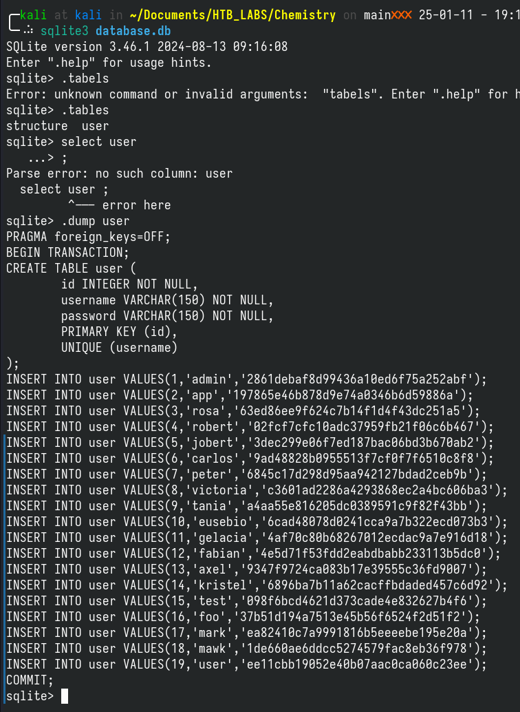
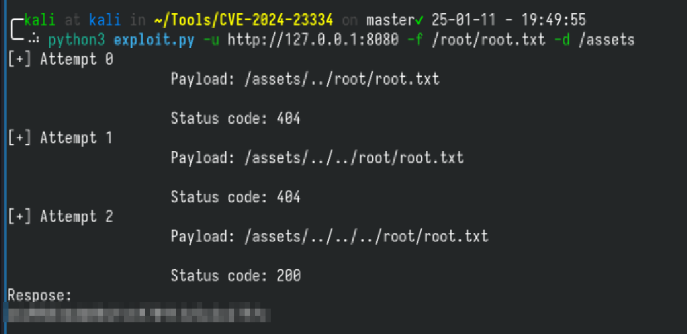

# Chemistry

## Tools

1. Nmap
2. [CVE-2024-23334](https://github.com/wizarddos/CVE-2024-23334)

## Scanning and Enumeration

After connecting to the VPN and getting the IP address to the Chemistry machine, the first thing that was done is to initialize an Nmap scan. The Nmap scan result is as below:

```bash
nmap --min-rate 3000 -A -p- 10.10.11.38
Starting Nmap 7.95 ( https://nmap.org ) at 2025-01-06 16:59 +08
Nmap scan report for 10.10.11.38
Host is up (0.021s latency).
Not shown: 65533 closed tcp ports (reset)
PORT     STATE SERVICE VERSION
22/tcp   open  ssh     OpenSSH 8.2p1 Ubuntu 4ubuntu0.11 (Ubuntu Linux; protocol 2.0)
| ssh-hostkey:
|   3072 b6:fc:20:ae:9d:1d:45:1d:0b:ce:d9:d0:20:f2:6f:dc (RSA)
|   256 f1:ae:1c:3e:1d:ea:55:44:6c:2f:f2:56:8d:62:3c:2b (ECDSA)
|_  256 94:42:1b:78:f2:51:87:07:3e:97:26:c9:a2:5c:0a:26 (ED25519)
5000/tcp open  http    Werkzeug httpd 3.0.3 (Python 3.9.5)
|_http-title: Chemistry - Home
|_http-server-header: Werkzeug/3.0.3 Python/3.9.5
Device type: general purpose
Running: Linux 4.X|5.X
OS CPE: cpe:/o:linux:linux_kernel:4 cpe:/o:linux:linux_kernel:5
OS details: Linux 4.15 - 5.19
Network Distance: 2 hops
Service Info: OS: Linux; CPE: cpe:/o:linux:linux_kernel

TRACEROUTE (using port 5900/tcp)
HOP RTT      ADDRESS
1   85.68 ms 10.10.16.1
2   34.51 ms 10.10.11.38

OS and Service detection performed. Please report any incorrect results at https://nmap.org/submit/ .
Nmap done: 1 IP address (1 host up) scanned in 20.36 seconds
```

Based on the nmap results above, it seems that there is a website that is being served on port 5000. Aside from that, port 22 (SSH) is also open but SSH will be hard to exploit. So the first thing to do is to visit the website.

### Visiting the website

Since there doesn't seem to be any obvious domain names from the nmap scan. We can visit the website by just typing in the IP address followed by `:5000`. After inserting them, we can press ENTER and we can see the website.


So the page that is presented to us is a login page and looking at the URL, there doesn't seem to be any parameters to perform SQL injection. So I started **Caido** to capture the requests and responses made to the server. After playing around with the login, I can login to the page using any kind of username:password combinations (I used test:test) and was brought to the dashboard.

However, regardless, I was able to capture the login request to the server and it is as below:

```text
POST /login HTTP/1.1
Host: 10.10.11.38:5000
User-Agent: Mozilla/5.0 (X11; Linux x86_64; rv:128.0) Gecko/20100101 Firefox/128.0
Accept: text/html,application/xhtml+xml,application/xml;q=0.9,image/avif,image/webp,image/png,image/svg+xml,*/*;q=0.8
Accept-Language: en-US,en;q=0.5
Accept-Encoding: gzip, deflate
Content-Type: application/x-www-form-urlencoded
Content-Length: 27
Origin: http://10.10.11.38:5000
Connection: keep-alive
Referer: http://10.10.11.38:5000/login
Upgrade-Insecure-Requests: 1
X-PwnFox-Color: cyan
Priority: u=0, i

username=test&password=test
```

In the request, we can see the data being `username=test&password=test`, which might be SQL injectable. So I used `sqlmap` to automate trying different kinds of SQL injection payloads but unfortunately, it didn't return any worthwhile results.

Moving on, in the dashboard, we can see that it allows us to upload a CIF file, which is a Crystallographic Information File. Further googling revealed this [vulnerability](https://github.com/materialsproject/pymatgen/security/advisories/GHSA-vgv8-5cpj-qj2f) in the **pymatgen** library that is used to parse CIF files in Python.

## Exploitation

Based on this information, I created a malicious CIF file that is able to establish a reverse shell (based on [revshell](https://www.revshells.com/)) back to my Kali machine and uploaded to the website. After uploading the malicious CIF file, it will be displayed in a table, and I just clicked on the **View** button and the page hanged. So I checked back my listener and a connection has been established.

Once connected, I checked the current user I am logged in as and it seems that I am currently logged in as `app`. However, `app`'s home directory does not have the user flag but it did have other subdirectories. So, I quickly checked the contents of those subdirectories (using `ls -R`) and it seems that the user flag is not hidden in any of them but there seems to be a db file.


So I jumped into the directory and explored the contents of the DB file. Based on the output from `cat`, it seems to contain a table with usernames and passwords but the output is miserable from `cat`. I tried to open using sqlite3 CLI tool but it seems that I cannot execute the tool in the server. So I downloaded the DB file from the server into my Kali machine. The process is like this:

1. Run `python3 -m http.server PORT` on the server
2. Go to my Kali machine and go to the directory where I want to have the DB file
3. Run `curl http://SERVER_IP_ADDRESS:PORT/database.db -o database.db

Using those 3 steps above, I successfully downloaded the DB file into my Kali machine and I was able to use sqlite3 to explore the DB file. The sqlite3 commands that I used are:

1. `.tables` to show all the tables in the DB file
2. `.dump TABLE` to dump all the contents of the specified TABLE

Once dumped, I was able to obtain the password hashes for all the users stored in the DB file. However, the only user that I am interested in is `rosa` as when I was enumerating `app`, I was able to find another username which is `rosa`.



So after obtaining the password hashes, I used `hashcat` to crack said hashes with the `rockyou` wordlist. And in a few moments, the hash has been cracked.

Using the username and cracked password, I tried logging in to the server via SSH (command was ssh rosa@IP_ADDRESS) and I was able to log in. Once inside, the first thing I did was to check whether the user flag is in the home directory and lo and behold, it is!

After that, I downloaded `linpeas` and executed it. The results from `linpeas` didn't show any promising results but it did show that there is another port that is open but not detected by `nmap`, which is port 8080.


So I exited the current SSH session and reestablish a new one that forwards the server's port 8080 traffic to my Kali machine. The command is `ssh -L 8080:localhost:8080 rosa@IP_ADDRESS`. Once the connection is reestablished, I visited `http://127.0.0.1:8080/` and at the same time, captured the traffic using `Caido`.

The website that is being served on port 8080 seems to be an internal monitoring tool. The tool doesn't seem to provide any opportunities to further exploit the server or perform privilege escalation. However, looking into the requests captured by `Caido`, it seems the HTTP Response Headers reveal further server information.


I googled the internet for any possible vulnerabilities for this Server type and version and apparently, it has a CVE attached to it, which is CVE-2024-23334.

Further googling revealed an available script by [wizarddos](https://github.com/wizarddos/CVE-2024-23334) and it allows us to perform LFI using the CVE-2024-23334 exploit. However, we need to first identify the directory that can be exploited. And to find it, I used dirsearch to find possible subdirectories for this internal tool and that subdirectory is `assets`

So using [wizarddos](https://github.com/wizarddos/CVE-2024-23334)'s tool and the `assets` directory, the command to perform the exploit is:

```bash
python3 exploit.py -u http://127.0.0.1:8080 -f /root/root.txt -d /assets
```

And the results are:


