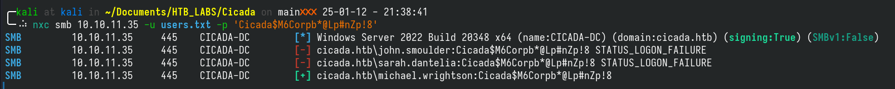

# Cicada

Cicada IP address: 10.10.11.35

## Tools

1. nmap
2. enum4linux
3. smbclient
4. winpeas
5. netexec (nxc)

## Scanning and Enumeration

### Nmap Scans 

```bash
nmap --min-rate 3000 -p- -A 10.10.11.35
Starting Nmap 7.94SVN ( https://nmap.org ) at 2025-01-11 22:38 +08
Nmap scan report for 10.10.11.35
Host is up (0.15s latency).
Not shown: 65522 filtered tcp ports (no-response)
PORT      STATE SERVICE       VERSION
53/tcp    open  domain        Simple DNS Plus
88/tcp    open  kerberos-sec  Microsoft Windows Kerberos (server time: 2025-01-11 21:23:29Z)
135/tcp   open  msrpc         Microsoft Windows RPC
139/tcp   open  netbios-ssn   Microsoft Windows netbios-ssn
389/tcp   open  ldap          Microsoft Windows Active Directory LDAP (Domain: cicada.htb0., Site: Default-First-Site-Name)
| ssl-cert: Subject: commonName=CICADA-DC.cicada.htb
| Subject Alternative Name: othername: 1.3.6.1.4.1.311.25.1::<unsupported>, DNS:CICADA-DC.cicada.htb
| Not valid before: 2024-08-22T20:24:16
|_Not valid after:  2025-08-22T20:24:16
|_ssl-date: TLS randomness does not represent time
445/tcp   open  microsoft-ds?
464/tcp   open  kpasswd5?
593/tcp   open  ncacn_http    Microsoft Windows RPC over HTTP 1.0
636/tcp   open  ssl/ldap      Microsoft Windows Active Directory LDAP (Domain: cicada.htb0., Site: Default-First-Site-Name)
| ssl-cert: Subject: commonName=CICADA-DC.cicada.htb
| Subject Alternative Name: othername: 1.3.6.1.4.1.311.25.1::<unsupported>, DNS:CICADA-DC.cicada.htb
| Not valid before: 2024-08-22T20:24:16
|_Not valid after:  2025-08-22T20:24:16
|_ssl-date: TLS randomness does not represent time
3268/tcp  open  ldap          Microsoft Windows Active Directory LDAP (Domain: cicada.htb0., Site: Default-First-Site-Name)
|_ssl-date: TLS randomness does not represent time
| ssl-cert: Subject: commonName=CICADA-DC.cicada.htb
| Subject Alternative Name: othername: 1.3.6.1.4.1.311.25.1::<unsupported>, DNS:CICADA-DC.cicada.htb
| Not valid before: 2024-08-22T20:24:16
|_Not valid after:  2025-08-22T20:24:16
3269/tcp  open  ssl/ldap      Microsoft Windows Active Directory LDAP (Domain: cicada.htb0., Site: Default-First-Site-Name)
| ssl-cert: Subject: commonName=CICADA-DC.cicada.htb
| Subject Alternative Name: othername: 1.3.6.1.4.1.311.25.1::<unsupported>, DNS:CICADA-DC.cicada.htb
| Not valid before: 2024-08-22T20:24:16
|_Not valid after:  2025-08-22T20:24:16
|_ssl-date: TLS randomness does not represent time
5985/tcp  open  http          Microsoft HTTPAPI httpd 2.0 (SSDP/UPnP)
|_http-title: Not Found
|_http-server-header: Microsoft-HTTPAPI/2.01
64813/tcp open  msrpc         Microsoft Windows RPC
Warning: OSScan results may be unreliable because we could not find at least 1 open and 1 closed port
Device type: general purpose
Running (JUST GUESSING): Microsoft Windows 2022 (89%)
Aggressive OS guesses: Microsoft Windows Server 2022 (89%)
No exact OS matches for host (test conditions non-ideal).
Network Distance: 2 hops
Service Info: Host: CICADA-DC; OS: Windows; CPE: cpe:/o:microsoft:windows

Host script results:
| smb2-security-mode:
|   3:1:1:
|_    Message signing enabled and required
|_clock-skew: 6h44m34s
| smb2-time:
|   date: 2025-01-11T21:24:26
|_  start_date: N/A

TRACEROUTE (using port 53/tcp)
HOP RTT       ADDRESS
1   238.84 ms 10.10.16.1
2   238.93 ms 10.10.11.35

OS and Service detection performed. Please report any incorrect results at https://nmap.org/submit/ .
Nmap done: 1 IP address (1 host up) scanned in 147.27 seconds
```

Based on the nmap scan above, there are several ports open and most of them are related to SMB and NetBIOS. For example, port 139 and 445 are well-known as SMB ports. 

Since I will be targeting on SMB ports, the tools that will be highly likely to be used are:

1. nxc
2. smbclient
3. enum4linux

So the first thing that needs to be done is to enumerate usable credentials and the first tool to use is `enum4linux`.

### Enum4linux results

Command used: `enum4linux -a -u guest -d 10.10.11.35`

The below is the information I obtained from enum4linux regarding the shares that are detected on the target machine.

```bash
==================================( Share Enumeration on 10.10.11.35 )==================================

do_connect: Connection to 10.10.11.35 failed (Error NT_STATUS_RESOURCE_NAME_NOT_FOUND)

Sharename       Type      Comment
---------       ----      -------
ADMIN$          Disk      Remote Admin
C$              Disk      Default share
DEV             Disk
HR              Disk
IPC$            IPC       Remote IPC
NETLOGON        Disk      Logon server share
SYSVOL          Disk      Logon server share
Reconnecting with SMB1 for workgroup listing.
Unable to connect with SMB1 -- no workgroup available

[+] Attempting to map shares on 10.10.11.35

//10.10.11.35/ADMIN$    Mapping: DENIED Listing: N/A Writing: N/A
//10.10.11.35/C$        Mapping: DENIED Listing: N/A Writing: N/A
//10.10.11.35/DEV       Mapping: OK Listing: DENIED Writing: N/A
//10.10.11.35/HR        Mapping: OK Listing: OK Writing: N/A

```

Based on the results above, I can only access the **HR** share using a guest account or no account at all (this is indicated in the command stated above, where `-u guest` indicate that the username being used is `guest` when enum4linux try to access these shares). So to connect to the **HR** share, I used `smbclient`. The specific command is `smbclient --no-pass //10.10.11.35/HR`

Once connected to the HR dev, I can use `help` to see what are the commands that can be used. `ls` is one of them and it allows me to list out the contents of the current directory.


Looking in the directory, a file named "Notice from HR.txt" is found and this file can be downloaded into my Kali machine by using the `get` command, as shown in the screenshot above (`get "Notice from HR.txt`).

Once the file is downloaded, I went back to my Kali terminal and used `cat` to view its contents. In file, they listed a credential that are used for default accounts in their organisation (enclosed between $$).

```
Dear new hire!

Welcome to Cicada Corp! We're thrilled to have you join our team. As part of our security protocols, it's essential that you change your default password to something unique and secure.

Your default password is: $Cicada$M6Corpb*@Lp#nZp!8$

To change your password:

1. Log in to your Cicada Corp account** using the provided username and the default password mentioned above.
2. Once logged in, navigate to your account settings or profile settings section.
3. Look for the option to change your password. This will be labeled as "Change Password".
4. Follow the prompts to create a new password**. Make sure your new password is strong, containing a mix of uppercase letters, lowercase letters, numbers, and special characters.
5. After changing your password, make sure to save your changes.

Remember, your password is a crucial aspect of keeping your account secure. Please do not share your password with anyone, and ensure you use a complex password.

If you encounter any issues or need assistance with changing your password, don't hesitate to reach out to our support team at support@cicada.htb.

Thank you for your attention to this matter, and once again, welcome to the Cicada Corp team!

Best regards,
Cicada Corp
```

However, I still do not have any usernames to test the password on. So, I used `nxc` to brute force rids in hopes to find available usernames that I can use. The command is `nxc smb 10.10.11.35 -u 'guest' -p '' --rid-brute`


Using these found usernames and the default password from the "Notice from HR" document, I can perform password spraying to find out which pair of credentials actually work. So to get this done, I used `nxc` again. But first I need to store all these usernames into a text file. Once that's done, the command used to perform password spraying is `nxc smb 10.10.11.35 -u USER_FILE -p PASS`.



The results show that the default password works with the user `michael.wrightson`. So using username and the default password, we can further enumerate to see what shares he can access and what other possible users there might be (since the previous user enumeration is done using **guest**).

So this time, the command used is `nxc smb 10.10.11.35 -u "michael.wrightson" -p 'Cicada....'`. Do note that the Cicada... password needs to be enclosed in single quote (') and not double quotes. It will only work with single quotes.


The results of this enumeration further revealed another pair of credentials. This time it is for david.orelious. So again, we repeat the same steps, enumerate users and shares again using his credentials.


So, this time, instead of revealing more info on the users, it revealed that david.orelious have READ access to the **DEV** share! So now, we can now reuse `smbclient` to find out what's hidden in **DEV**, command is `smbclient -U 'david.orelious%PASS' //10.10.11.35/DEV`.

Once inside, we can see a Powershell script, named Backup_script (extension is ps1). So using the same method as above, I downloaded the script and took a look. Inside this file, it revealed another user's password, this time it is emily.oscars.

So, again I try to enumerate using emily.oscars credentials using `nxc` and this time, it tells us that emily have access to the **C** share. Again, using smbclient, I accessed the **C** drive using emily's credentials. And in the **Desktop** directory, I found the user flag.


## Privilege Escalation

Ok, so now I am in as emily, but I need to escalate my privileges to get access to the root flag. First I need to find out how. So I upload `winpeas`, the equivalent of `linpeas` but for Windows. I can do this using the `put` command in smbclient I need to first copy `winpeas` into the current directory where smbclient is executed or it will not work because I cannot invoke `curl` or `wget` in `smbclient`.

So once `winpeas` has been uploaded into the location I want, I tried executing within `smbclient` itself but it did not work. I googled how I can do this, tried `psexec` and `smbexec` but both didn't work. Then I went back to the nmap results to see what I could be missing.

So there are a few ldap ports but I don't think those can let me execute any commands so I look into the other ports and 5985 seems to be a well-know port. So I searched it up in Hacktricks and they mentioned it being related to winrm and ways to check it.

Based on Hacktrick's guide, I can use `nxc` to check whether I can exploit winrm. So the command is `nxc winrm -u 'emily.oscars' -p 'PASS' 10.10.11.35` and lo and behold, it is vulnerable. The tool recommended by Hacktricks to exploit this is `evil-winrm` and the usage is already in Hacktricks, so refer there.

Once I have access to the terminal/command prompt/powershell, I went back to the directory where I stored `winpeas` and executed it.

The results from `winpeas` was a lot, but after reading it through carefully, I saw that emily have several privileges granted to her and one of them is `SeBackupPrivilege`. So I did some research into this privilege and it seems that there are ways to escalate privileges using this. So again, I referred to Hacktricks and they had a [guide](https://book.hacktricks.wiki/en/windows-hardening/active-directory-methodology/privileged-groups-and-token-privileges.html) under 'Local Attack' on it to do it manually.

In conclusion, the guide worked but I need to first find the necessary dlls and download it into the victim machine before successfully executing the attack. I also needed to create the **Temp** folder in the guide but it wasn't actually needed, just required a directory that emily have write access to.

The place where I got the dlls is in this [github repo](https://github.com/giuliano108/SeBackupPrivilege).
