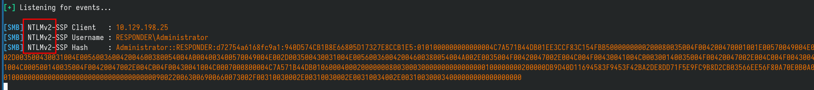

# Responder

Application exploited: Website --> LFI --> NTLM Hash capture with Responder --> NTLM hash cracking --> WinRM exploitation

## LFI

Basically when you see any fields that can be possibly used for SQLi or XSS or Command Injection, test for Local File Inclusion (LFI) as well. Wordlist can get from Auto-Wordlist github and then test using ffuf

## NTLM Hash capture with Responder

Basically can invoke any random remote shares (in HTB cases, our Kali machine's VPN IP address) and then attampte to capture the hash via Responder using the VPN interface

## NTLM hash cracking

So, to know what version of NTLM hash we got through Responder as shown in the picture below

## WinRM exploitation

This is basically the service that is running on port 5985 and 5986, service name `Microsoft HTTPAPI httpd 2.0 (SSDP/UPnP)`. 

To exploit this service, the username and password is first required. Password spraying/brute force can be achieved using `nxc` and once the username:password pair has been identified, can use `evil-winrm` to establish a reverse connection to the pwned machine.

